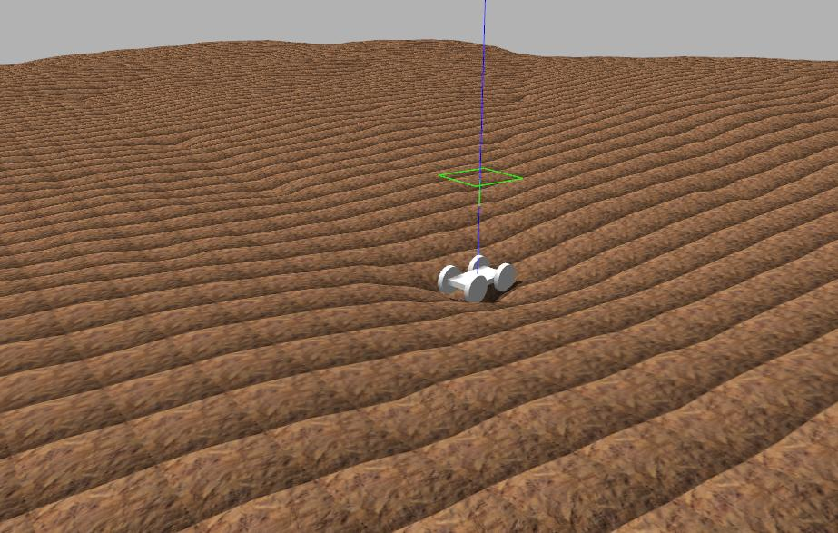
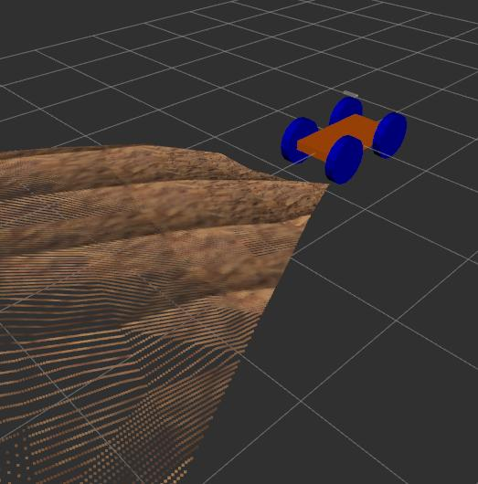

# Simple Rover ROS 
A simple template to get started with simulated mobile robots and stereo vision in ROS.

## Requirements
* ROS Kinetic*
* Gazebo

\* Tested with ROS Kinetic, but may also work with other ROS versions.

## Installation
    cd ~/catkin_ws/src
    git clone https://github.com/djorna/simple_rover_ros.git
    cd ..
    catkin_make --pkg simple_rover_ros

## Demos

### Gazebo world
    source ~/catkin_ws/devel/setup.bash
    roslaunch rover_simple_gazebo rover_world.launch

### Gazebo world with Rviz and custom height map 
    source ~/catkin_ws/devel/setup.bash
    roslaunch rover_simple_gazebo rover_world_2.launch

